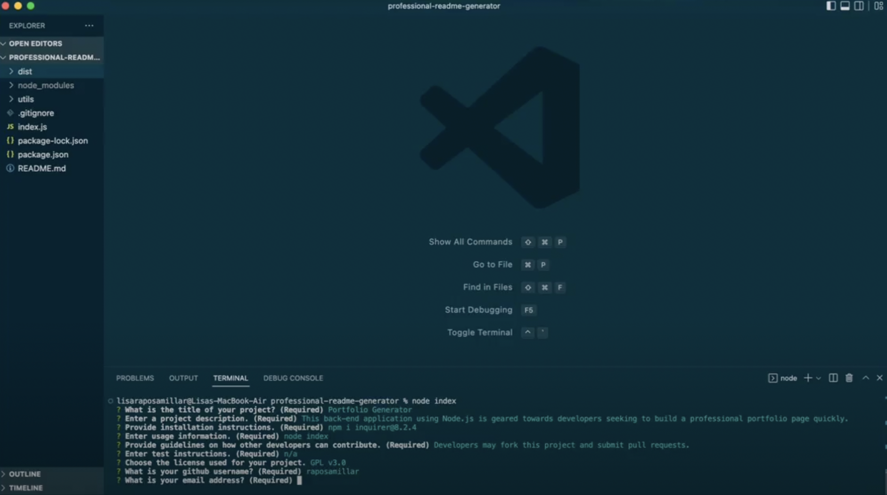

# README Pro

  ###  

  ## Table of Contents
  - [Description](#description)
  - [Installation](#installation)
  - [Usage](#usage)
  - [Contributing](#contributing)
  - [Tests](#tests)
  - [Questions](#questions)
  - [License](#license)

  ## Description 
  This back-end application is geared towards developers seeking to build a professional README file quickly. 
  <a href="https://drive.google.com/file/d/1L0tXZcY0VgQVan58HuvqVKbDvOCLYS3H/view?usp=sharing">Walkthrough Video Link</a> 
  <a href="https://github.com/raposamillar/portfolio-generator">Sample README File</a>  
  N.B.: Bootcamp study project
  
  ## Installation 
   1. Install Node.js in the root directory of your local machine. LTS version recommended. (https://nodejs.org) 2. Download or clone the files in this repo. 3. Install npm i inquirer@8.2.4 
  
  ## Usage
  Invoke the application from the command line with: node index 

  ## Contributing 
  Developers who have ideas for improvement may fork this project and submit pull requests for review.

  ## Tests
  n/a

  ## Questions 
  Please feel free to reach out via either of the links below if you have additional questions about this application. 
  GitHub: <a href="https://github.com/raposamillar/">raposamillar</a> 
  Email: lisa.raposamillar@gmail.com

  ## License
  ### This application is covered under the [GPL v3.0](https://choosealicense.com/licenses/gpl-3.0/) license.

  
  